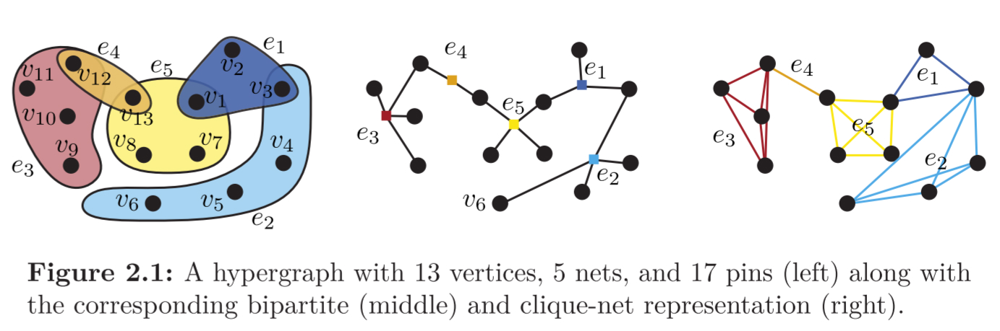
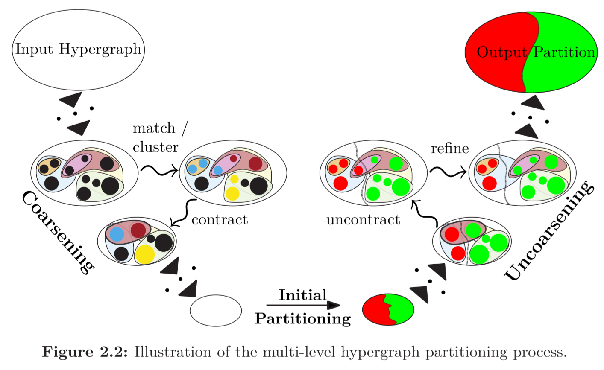
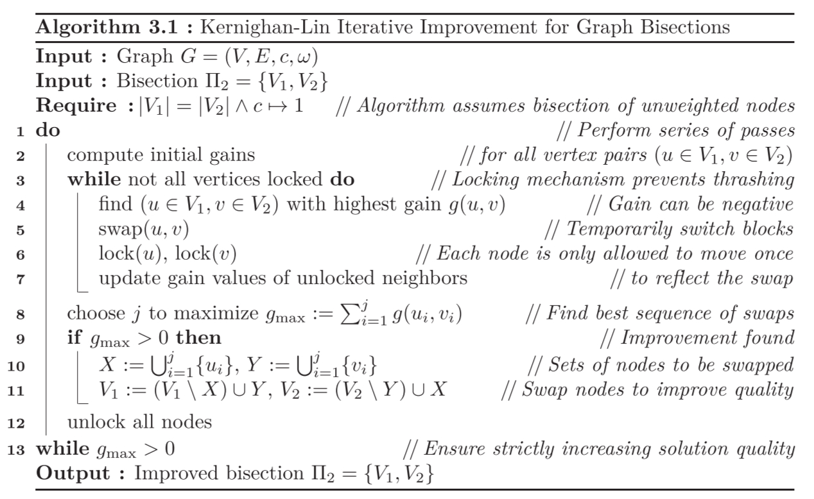
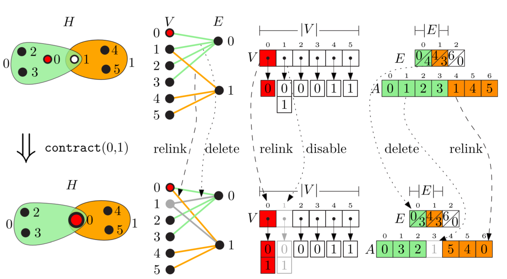

# Dissertation Note
- [Link](https://publikationen.bibliothek.kit.edu/1000105953)

## Abstract
- 问题定义：Balanced hypergraph partitioning
  - 给定一个超图H以及正整数k，将超图的节点集划分为k个不相交的节点块，每个节点块的大小都有上界；同时最小化目标函数（如cut-net或者connectivity）
- 算法概述
  - 启发式的三阶段多层次图割算法
    - coarsening（节点收缩）
    - initial partitioning
    - uncoarsening and refinement

## Introduction
### Motivation
- 传统的图分割
  - 用于关系网络的处理，通常作为一种预处理技巧
  - edge只能连接两个node，无法处理更为复杂的情况
  - 面对VLSI（very-large-scale integration）能力有限
- 超图与超图分割（HGP）
  - node->vertex
  - edge->hyperedge/net，可以连接两个及以上的vertex
  - 应用
    - VLSI设计，节约external wire带来的cost与delay
    - 数据分布式存储
    - 稀疏矩阵的计算

## Preliminaries
### Notation and Definitions
- Hypergraph
  - vertex
  - hyperedge/net
  - 衍生出的各种定义
  - 超图的两种子结构
    - sub-hypergraph
    - section hypergraph
- Contractions and Uncontractions
  - vertex的收缩与扩张
- Representation of Hypergraph
  - 基于clique（net->完全图）
  - 基于bipartite（二分图表示法）
  - 
### k-way Hypergraph Partitioning Problem
- 两种常见的metric
  - cut-net适合2分的时候使用
  - connectivity适合$k$分$(k \ge 3)$的时候使用
- 在VLSI中，如果一个net连接了多个block，那么会消耗更多的资源，因此此时引入connectivity这种metric是更加合理的
- 算法分类
  - Recursive Bisection
    - 适合k是2的幂次的时候使用，如果k不满足，得到的块的大小将需要调整
  - Direct $k$-way partitioning
    - 直接堆initial hyper graph进行k-partitioning
### Related Problem Formulations
- 其他的metric
- Naturally Imbalanced Partitions
  - 用户自定义两个bound，修改之前的balance约束
- 其他的任务（Hyperedge partitioning）
- 多目标、多约束
### Computational Complexity
- 略
### Algorithmic Approaches
- Local Search
  - 基于neighborhood structure和history of search寻找新的解
  - neighborhood structure定义了移动方式，比如交换两个vertices所属的block，将某个vertex移动到另一个block
  - 基于是不是用history可以分为贪心算法和其他更复杂的算法（有点像DP）
- Hill Climbing/ Iterative Improvment (IIP)
  - 也是一种local search，从某个feasible solution出发，不断寻找更优的邻居解，直至收敛
- Spectral Partition
  - 像GNN/GCN里面的思路，对Graph的Laplacian矩阵进行分解（比如特征值分解）
- Multi-level Diagram
  - 启发式算法
  - 三阶段
    - coarsening
    - initial partitioning
    - uncoarsening/refinement
  - 
- Memetic
  - 基因算法（遗传算法）
### Evaluation
- 略

## History of HGP
### Kernighan-Lin (KL) Algorithm
- 是各种IIP算法的基础
- 输入图和bisection，输出优化的bisection
- 中心思想就是计算gain并交换“分错”的vertex
- 
- gain
  - 首先计算每个vertex的gain，设其属于A，则gain就是将其从A移动到B引起的internal edge和external edge的变化。如果有更多的external edge变成了internal edge，那么gain就大
  - $g(u) := \omega(\{ (u,v)| v \in \Gamma(u) \cap B \}) - \omega(\{(u,v)| v \in \Gamma(u) \cap A\})$
  - 为了保持bisection，每次需要交换（swap）一对节点
- Limitations
  - bisection（要求两个节点块的大小至多相差1）
  - vertex的权重为1
### Fiduccia-Mattheyses (FM) Algorithm
- 可以应用于bipartitioning ($\varepsilon$-balanced即可)
- 从swap vertices pair变为move single vertex
- Moving FM Gain
  - $I(v)$是与某个vertex $v$相连的net的集合
  - $\Lambda(e)$是与某个net $e$相交的节点块的集合
  - $\Phi(e, V_i) := \lvert e \cap V_i \rvert$也就是求某个net和节点块的交集的大小，也就是这个net在这个节点块中的number of pins
  - 设某个vertex属于节点块0，那么将其从0移动到1带来的gain就是$$g(v) := \omega(\{ e \in I(v) | \Phi(e,V_1) = \vert e \vert - 1 \}) - \omega(\{ e \in I(v) | \Phi(e,V_0) = \vert e \vert  \})$$
  - 前项就是从cut-net变成internal-net的数量，后项就是从internal-net变成cut-net的数量，和之前KL算法中的gain有相似之处
- Balanced bipartition
  - 放宽了balance的约束
- 与KL过程类似，从swap变成了move
### Single-Level Partitioning beyond KL/FM
- 基于KL和FM算法衍生出很多single-level的算法
- level体现在并没有对graph进行coarsening，直接对original graph进行分割和操作
### From Two-Level To Multi-Level Partitioning
- 介绍了一堆算法，但只是提了一下

## $n$-Level Hypergraph Partitioning
- 正式介绍Karlsruhe Hypergraph Partitioning也就是KaHyPar
### Data Structure
- 将Hypergraph表示为bipartite（二分图）G，G的节点集是超图的vertices和nets，如果$v \in e$，那么$(e,v)$就是G中的一条edge
- 
  - $V$数组表示了每个vertex属于的net
  - $E,A$两个数组表示了net连接的vertex，其中$E$的每个entry有两个分量，分别是这个net在$A$的from(f)和size(s)
- Contraction
  - 对于一个vertex-pair $(u,v)$，判断其contraction-partner $v$是直接delete还是relink
- Uncontraction
  - 判断是需要revert a delete or relink
### Computing $k$-way Partitions via Recursive Bipartitioning