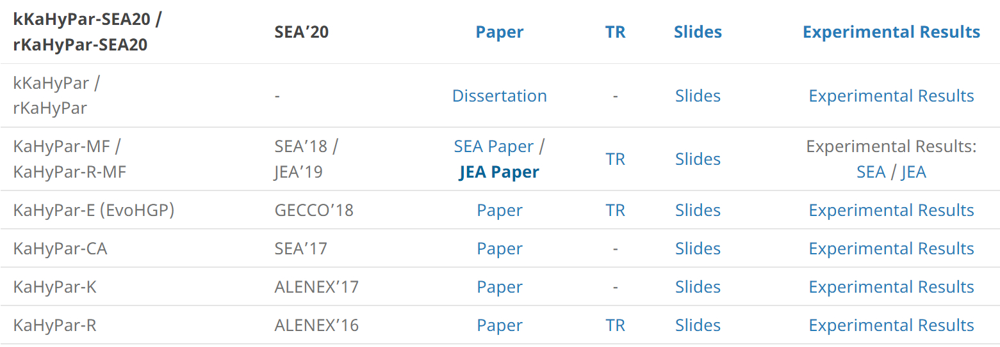

# 20220406
## Wiki
- [Github Wiki](https://github.com/zerzerzerz/graph-partition)
## 传统算法
- [传统算法.md](../传统算法.md)
- KL and FM
- 对节点集进行二分
### Overview
  - Initial Partitioning
  - Gain Computation
  - Swap/Moving

## 现代算法
- [Tools Webpage](https://kahypar.org/)
- [基本概念.md](../基本概念.md)
- [算法.md](../算法.md)
- [学位论文笔记.md](../Dissertation-Note.md)
- 
### Common
- Coarsening
- Initial Partitioning
- Refinement (Uncontraction + Local Search)
### Recursice Bisection
- 递归二分，根据选择的metric对不同的超图子结构进行递归
- Initial Partitioning进行初始的二分
- Local Search阶段只需要维护两个PQ
### Direct $k$-way
- 没有递归的阶段
- 将RB算法的结果当作Initial Partitioning
- Local Search阶段需要维护$k$个PQ
### Technique
- Delta Gain Updating
- Caching Gain
- Min-Hash Based Pin Sparsifier