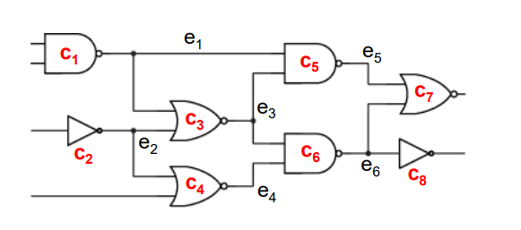
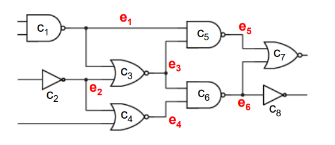

# 图割传统算法介绍
- 从VLSI入手，抽象出超图
- [Link](https://eecs.wsu.edu/~daehyun/teaching/2015_EE582/ppt/02-partitioning.pdf)

## 问题定义
- 将电路中的每个gate视为一个cell $c_i$，放在图中就是一个vertex或者node，每个cell都有自己的size，记为$s(c_i)$
- 电路中的连线视为edge $e_i$或者net，每条edge都有自己的权重weight，记为$w(e_i)$
- 
  - 每个gate定义为一个cell
- 
  - 这里是hyperedge的情况，每个edge（net）可以连接多个pin

## Kernighan-Lin Algorithm (KL)
### Task
- 给定节点集，边集，和每条边的权重，每个节点的权重视为1
- 将节点集划分为两个集合AB，且满足AB两个集合大小相等，同时minimize cutsize作为objective
### Process
- Initial partition
  - 将节点集随机进行划分
- Gain computation
  - 对于每个cell，需要计算它的D-value
    - 下面计算cell a的D-value，并假设a属于part A
    - External cost $E_a := \sum_{v \in B}w(e_{av})$
    - Internal cost $I_a := \sum_{v \in A}w(e_{av})$
    - D-value of a $D_a := E_a - I_a$
  - 得到每个cell的D-value之后，就可以计算全部节点对之间的gain
    - Gain of cell pair $(a,b), g_{ab} := D_a + D_b - 2w(e_{ab})$
  - 之后从全部的gain中选取最大的，记为$g_i$，交换选中的节点对中两个节点各自所属的part，然后将这两个节点对锁定，不再参与之后的计算
  - 重新计算剩余未锁定的节点的D-value，重复上述过程，直到全部的cell都被锁定
- Swap (Accumulated)
  - 当全部节点都被锁定之后，计算$k = \mathrm{argmax}_{k}\sum_{i=1}^{k}g_i$，选取k作为这次的划分结果
- 将刚刚得到的划分结果作为下一次划分的initial partition，重复上述流程

## Fiduccia-Mattheyses Algorithm (FM)
### Task
- 解决之前提到的hyperedge的情况
- 依然是将Hyper graph进行二分，但是引入了balance criterion，避免算法将全部的cell分类到同一个block中
- Move a cell instead of swapping two cells
- 补充新的定义
  - Cutstate of net(用来定义一个net的状态，否是是割集)
    - uncut
      - 这个net的全部cell都属于同一个part
    - cut
      - 这个net的cells属于两个partitions
  - Distributions of net $n$
    - $(A(n), B(n))$
    - $A(n) :=$ # cells connected to n in A
    - $B(n) :=$ # cells connected to n in B
    - 分别看看AB两个partition中有多少个cell与net相连
  - Critical net
    - 对于一个net，如果它有这样一个cell：将这个cell移动（move）之后，这个net的cutstate发生改变，那么这个net就是critical net
    - 或者可以从这个net的distribution来考虑是不是critical net
      - cut->uncut
        - (1,x)
        - (x,1)
      - uncut->cut
        - (0,x)
        - (x,0)
### FM overview
  - Gain computation
  - Select a base cell (a max-gain cell)
  - Move and lock base cell and update gain
### Process
- Gain computation
  - gain是针对每个cell而言的
  - 假设一个cell属于partition A
  - 设c为一个cell，则$g(c) = FS(c) - TE(c)$
    - $FS(s) := \vert P \vert s.t. P = \{ n | c \in n, dis(n) = (1,X) \}$
    - $TE(s) := \vert P \vert s.t. P = \{ n | c \in n, dis(n) = (X,0) \}$
  - 如果cell是partition B，那么FS和TE中的distribution也需要修改判断条件
  - FS可以理解为，move cell from A to B之后，cell所属的net，cutstate从cut变成uncut的数量
  - TE可以理解为，move cell from A to B之后，cell所属的net，cutstate从uncut变成cut的数量
  - 计算得到全部cell的gain
- Select a base cell
  - base cell也就是cell with max gain
  - before move base cell, update the gain of all other cells
    - 选出一个base cell之后，目前它属于的block记为from block $F$，将要移动到的block记为to block $T$
    - for each net $n$ connected to the base cell $c$
      - if $T(n) == 0$
        - for $c \in n$
          - gain(c)++
      - if $T(n) == 1$
        - for $c \in n$
          - gain(c)--
      - if $F(n) == 1$
        - for $c \in n$
          - gain(c)--
      - if $F(n) == 2$
        - for $c \in n$
          - gain(c)++
      - F(n)--
      - T(n)++
    - 其中$F(n)$表示n和from block的交集中的cell的个数，$T(n)$同理
    - 总的来说就是避免了重复计算gain，节省时间
- Move and lock
  - 移动该base cell，并将其lock
  - 计算best move sequence
### Summary
  - Computing gain of cell
  - Moving cell with best gain and updating gain
  - Finding best moving sequence