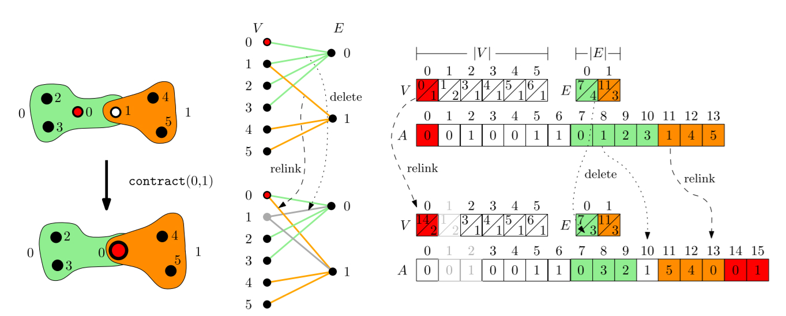
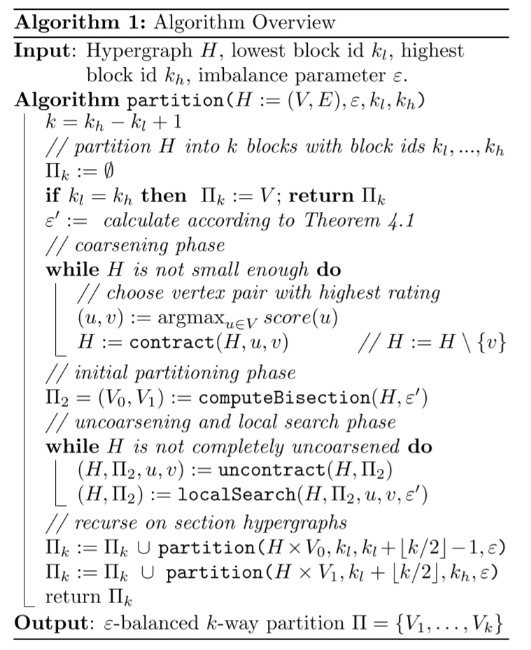

# 论文阅读笔记
## Recursive Bisection (RB)
- [k-way Hypergraph Partitioning via n-Level Recursive Bisection
](https://epubs.siam.org/doi/abs/10.1137/1.9781611974317.5)
- 将$k$分为$k_1$和$k_2$,根据新的k值计算出新的$\varepsilon$,这样就转化为两个$k'$分割问题
- Coarsening
  - 合并超图中的节点，此时的超图还是完整的超图
  - 选择需要合并的节点对
    - 对任意节点u，遍历其邻居v，对（u，v）节点对进行rating，使用heavy edge rating function，简单来说就是uv之间的edge如果weight越大且size越小，则rating越高
    - 根据rating从高到低对节点对进行contracting，直到图的规模足够小
  - 在contracting的过程中，可能产生下面两种冗余的net
    - single node net，直接去除
    - parallel net，这些net含有完全相同的vertices，只保留一个，同时修改留下来的这个net的weight
- Initial Partitioning
  - 执行很多算法，将图分为两块，也就是之前recursive bisection中提到的两块
  - 比如使用随机分配算法、BFS、贪心算法等等
  - 选择一个cut最好、imbalance最小的作为initial partition
- Localized FM local Search
  - FM算法可以参考[Link](传统算法.md)，也是对一个超图进行二分的算法
  - 下面将描述作者使用的算法
    - 使用两个优先级队列来维护vertex可能的move（在FM算法中，vertex又称为cell），每个block使用一个优先级队列
    - 在每一次的local search开始前，将所有的队列置为empty与disabled；当一个队列是disabled的时候，移动下一个节点的时候将不会考虑该队列
    - 每次uncontraction之后，将representative激活；如果新增的节点是border vertex的话，也将其激活
    - 节点的激活
      - 将节点移动到其他的块（这里应该是就总共两块）中去，并计算一个由此移动带来的增益gain，并将gain以及节点移动到目标块对应的队列中
      - 寻找最高的gain并移动对应节点，更新邻居节点
- Hypergraph Data Structure
  - 这一部分主要是介绍contraction和uncontraction的算法
  - 将超图H表示为一个无向的二分图
  - 二分图就是，可以将节点划分为两个集合AB，则相同集合内的节点不直接相连，也就是所有的边都是跨集合的
  - 将超图H表示为二分图G，H的vertices和nets视为G的nodes，G的边集（set of edges）定义为$F := \{ (e,v) | e \in E, v \in e \}$，也就是说，原来的超图中，将所有incident的(e,v)都在G中添加edge的关系
  - 如何表示这个二分图G
    - offset array, $V$ and $E$
    - incidence array $A$
    - 
      - 用这张图来描述一下VAE三个数组
      - 先看A数组，它存储了G所有边的终点
      - VE数组中，每个entry有两个分量，分别表示这个node在A的from和size（用f和s表示）
      - 比如上图右上方中，V[0].f = 0，表示所有以vertex 0为起点的edge的终点，从A[0]开始读取，一共有V[0].s = 1这么多；E[1].f = 11,表示所有以net 1为起点的edge的终点，从A[11]开始读取，一共有E[11].s = 3这么多
    - 注：在Hypergraph中，用net和vertex表示节点，在二分图G中，用edge和node来表示节点
    - 有了这种表示方法，就可以来执行contraction和uncontraction算法（详见论文）
- 
  - 整体的算法可以表示成上图的流程，是一个二分+递归的方法

## direct $k$-way partitioning
- [Engineering a direct k-way Hypergraph Partitioning Algorithm](https://epubs.siam.org/doi/abs/10.1137/1.9781611974768.3)
### RB算法有一些缺点
  - 比较适合k是2的次幂的形式，当k不是2的整数次幂就不是很合适
  - 缺少全局信息
  - 面对hypergraph with many large nets是效果有所下降
  - 比较适合cut这种metric，不是很适合connectivity这种metric
### 新的算法
  - coarsening
  - initial k-way partitioning
  - local search/refinement/uncoarsening

### Min-Hash Based Pin Sparsifier
- 计算gain时需要遍历neighbours，花费时间，为了缓解这个影响而引入pin sparsifier
- Central Idea
  - Contracting vertices shared with many nets and leaving "distant" vertices untouched
- Distance
  - 定义两个vertex之间的距离
- Min-hash family
  - 有这样一族哈希函数，满足这样的性质
    - 当定义域中的pq两个元素距离小于R时，二者哈希值相等的概率大于等于P1
    - 当pq的距离大于等于cR时，二者哈希值相等的概率小于等于P2
  - $\Sigma$ is set of hash functions of the form $\sigma(x) = ax + b \pmod{\mathcal{P}}$
  - min-hash family $\mathcal{H} = \left \{ h_\sigma(I(v)) = \min \{ \sigma(e) | e \in I(v)\} \right \}$
  - 可以从min-hash中选取若干个hash function对某个vertex求其hash value，构成这个vertex的fingerprint
  - 当两个vertex的fingerprint完全一致时，将其归为同一个cluster
  - 提出算法，构建hash table的同时进行clustering，中心思想就是多次迭代，逐渐增长指纹的size，每次将指纹相同的vertex进行clustering

### $n$-level direct $k$-way partitioning
#### Coarsening
- 遍历节点集时，先shuffle，根据heavy-edge寻找partner，然后立即contraction，直到节点集中的节点全是代表元
- 遍历若干次节点集，直到节点数$t \le 160k$
- 检测和消除parallel nets
  - 消除parallel nets与否不影响quality，但是消除之后可以加速
  - 通过定义fingerprint of net来消除parallel nets

#### Initial Partitioning
- 适用于connectivity的n-level RB算法

#### Localized adaptive $k$-way FM Local Search
- 和之前的算法是类似的
- Delta Gain Updating
- Gain Cache